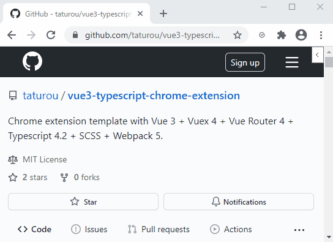
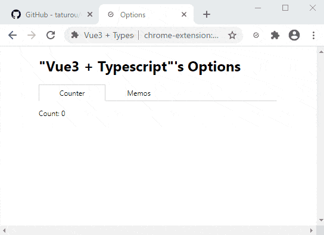
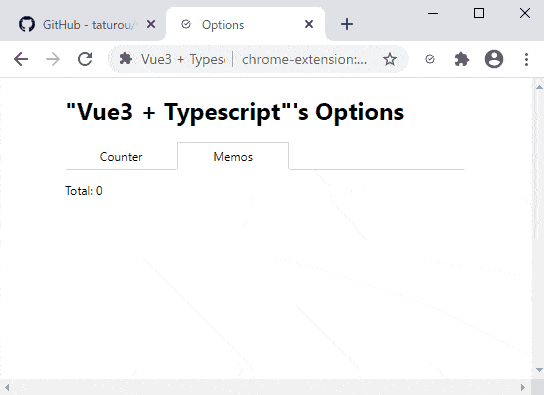
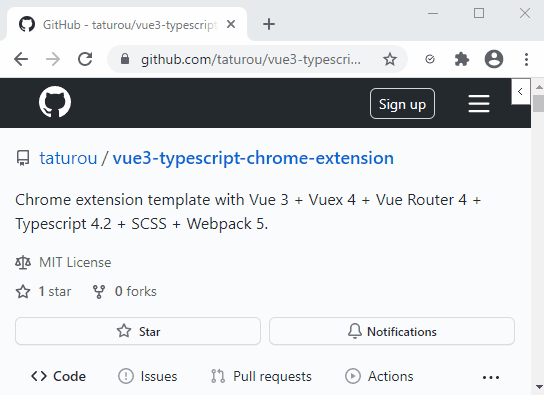

# Vue.js 3 Chrome Extension Template

[In Japanese.](https://qiita.com/taturou/items/f3e594716d174ee9bada)

Chrome extension template for vue-cli with Vue 3 + Vuex 4 + Vue Router 4 + Typescript 4.2 + Webpack 5.

Product name | npm package name | npm package version
:--|:--|:--
Vue.js | vue | 3.0.7
Vuex | vuex | 4.0.0
Vue Router | vue-router | 4.0.5
Typescript | typescript | 4.2.3
Pug | pug | 3.0.2
SASS/SCSS | sass-loader | 11.0.1
Webpack | webpack | 5.26.0
jQuery | jquery | 3.6.0

Notes: \
This sample is checked with `node v15.11.0`, `npm v7.7.4`, `@vue/cli 4.5.12`, and `Chrome 89.0.4389.90 (64-bit)`. \
This sample does not use any Vue libraries and any CSS frameworks. \
The chrome-extension manifest version is v2 (MV2).

---

## Features



### Popup page


It has the following sections.

* Options
  * Opning the options page of this chrome-extension.
* Counter
  * Count Up/Down button.
  * The value will sync between the options page.
* Memos
  * Add a memo.
  * The options page display all memos that are added by this section.
  * The value will sync between the options page.

Those values will be saved to the LocalStorage of Chrome via the Vuex store.

### Options page




It has the following tab.

* Counter
  * It displays the counter value that was updated by the popup page.
* Memos
  * It displays the memos that were added by the popup page.
  * You can update a memo specified.

This page is generated with Vue-Router.

Those values will be saved to the LocalStorage of Chrome via the Vuex store.

### Content script / Counter



It displays the counter value that was updated by the popup page.

The collapse button will be located to the top-right of all web pages.
If you push the button, it displays the counter that the popup page counts up/down.

### Backgroud script

This will save the value of the Vuex store to the LocalStorage of Chrome via a message from the popup page and the options page.

---

## Usage

Create a project by using vue-cli with this template.

```bash
$ npm install -g @vue/cli @vue/cli-init
$ vue init taturou/vue3-typescript-chrome-extension#vue-template <project-name>
(*1) Choose some options.
$ cd  <project-name>
$ npm install
$ npm run build
```

(*1) You can choose the following options:

* Product Name (not include space characters)
* Chrome extension Name
* Description
* Author
    * e.g.: "taturou <taturou@gmail.com>"
* Use an OSS License?
    * Choose the two below options too if 'Y'.
* Pick a license: (Use arrow keys)
    * There are the following licenses.
        * Apache License 2.0
        * BSD 2-Clause Simplified License
        * BSD 3-Clause New or Revised License
        * Eclipse Public License 2.0
        * GNU General Public License v3.0
        * GNU Lesser General Public License v2.1
        * MIT License
        * Mozilla Public License 2.0
* Copyright year:
* Chrome extension's manifest versions:
    * There are the following versions.
        * v2
        * v3

---

## npm scripts

* Build chrome-extension without debug information to './dist'.
  ```
  $ npm run build
  ```

* Build chrome-extension with debug information to './dist'.
  ```
  $ npm run debug
  ```

* Build chrome-extension with debug information and watch mode.
  ```
  $ npm run watch
  ```
  Note: \
  It does not support the hot reload. Reload the extension manually after building it.

* Zip the './dist' to './dist_zip/(product-name)-(product-version).zip'
  ```
  $ npm run zip
  ```
  Notes: \
  (product-name) is the "name" property of the package.json. \
  (product-version) is the "version" property of the package.json.

* Remove './dist'
  ```
  $ npm run clean
  ```

---

## The structure

```
.
|-- dist_zip/               -- Products compressed are here if you execute 'npm run zip'.
|-- scripts/                -- Script files for the package.json's commands.
|-- src/
|   |-- @types/             -- Global types for Typescrip.
|   |-- background/         -- background script.
|   |   `-- message/        -- The message dispatcher from the popup/options/content.
|   |       `-- repository/ -- The module accepts messages from the repository library.
|   |-- contents/           -- content scripts.
|   |   |-- counter/        --
|   |-- icons/              -- Icons for the extension.
|   |-- lib/                -- Library
|   |    |-- components/    -- Vue components for all apps/components.
|   |    |-- repository/    -- Repository to save the values of the Vuex store via the background script.
|   |    |-- storage/       -- A storage called by the background script.
|   |    |-- store/         -- Vuex store.
|   |    `-- tabs/          -- Operate the browser tab.
|   |-- options/            -- Options page.
|   |-- popup/              -- Popup page.
|   |-- util/               -- Utilities
|   |    |-- Date/          -- Operate the Data object.
|   |    |-- object/        -- Operate the general object.
|   |    `-- string/        -- Operate the general string.
|   `-- manifest.json       -- Manifest file.
|-- .eslintrc.js            -- Lint config for ESLint.
|-- .gitignore              -- Ignore files for git.
|-- LICENSE                 -- License file.
|-- package-lock.json       -- npm lockfile.
|-- package.json            -- Build script and packages dependencies.
|-- Readme.md               -- This file.
|-- tsconfig.eslint.json    -- Lint config for Typescript.
|-- tsconfig.json           -- Config for Typescript.
`-- webpack.config.js       -- Config for webpack.
```

### manifest.json

The following properties will be updated.

* name
    * This will be replaced by the "productName" of the package.json.
* version
    * This will be replaced by the "version" of the package.json.
* description
    * This will be replaced by the "description" of the package.json.

### Vuex store (src/lib/store)

This store supports the module.
In other words, you can use the following methods:

e.g.: If a store whose module name is 'moduleA' has 'property1' property.

* `const value = store.getters['moduleA/property1']`
* `store.commit('moduleA/property1', value)`
* `store.dispatch('moduleA/property1', value)`

In addition, the parameter types are defined by Typescript, you can predict the parameters with the benefit of the editor.

The data managed by the Vuex store will be saved to storage through the following path.

Sequence | Caller module | Callee module | Called method
:--:|:--|:--|:--
1 | Popup, Options, content | Vuex            | store.getters, store.dispatch()
2 | Vuex                    | repository      | repository.foo()
3 | repository              | chrome          | runtime.message.sendMessage()
4 | chrome                  | background      | the callback which is set to runtime.onMessage.addListener()
5 | background              | storage         | storage.get()/set()
6 | storage                 | LocalStorage    | LocalStorage.getItem()/setItem()

### Storage (src/lib/storage)

The storage library supports the following storage.

* [LocalStorage](https://developer.mozilla.org/en-US/docs/Web/API/Window/localStorage)
* [chrome.storage.local](https://developer.chrome.com/docs/extensions/reference/storage/#property-local)
* Mock
    * Saves data to the javascript variables.

If you choose 'v2' as the manifest version, this template uses 'LocalStorage' by default. \
If 'v3', it uses 'chrome.storage.local' by default. \
In both versions, you can use 'Mock' by using the commands below.

```bash
$ npm run debug:mock
or
$ npm run watch:mock
```

---

## The structure of the extension that will be created

```
.
|-- background/         -- background script.
|   `-- index.js
|-- contents            -- content scripts.
|   `- counter/
|      |-- index.css
|      |-- index.html
|      `-- index.js
|-- icons/              -- Icons for the extension.
|   `-- ...
|-- options/            -- Options page.
|   |-- index.css
|   |-- index.html
|   `-- index.js
|-- popup/              -- Popup page.
|   |-- index.css
|   |-- index.html
|   `-- index.js
`-- manifest.json       -- Manifest file.
```

---

## Future work

* Supports 'Vue.js devtools' chrome-extension.
    * I don't understand why the chrome-extension does not recognize this project...
* Supports the chrome extension manifest v3 (MV3).
    * MV3 supports only a service worker instead of a background script. \
      But a service worker can not access the LocalStorage, as far as I know. \
      This extension must use the LocalStorage to save data of the Vuex store.

---

## License

MTI
